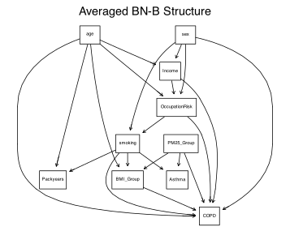
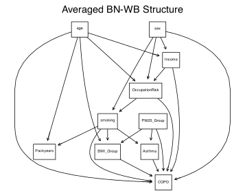

# Modeling Results (Logistic Regression & Bayesian Network)

This folder contains R Markdown outputs related to the COPD prediction modeling.
The `.Rmd` file includes logistic regression (LR) modeling and Bayesian network (BN) structure learning
based on the processed dataset (`lr_ready_data`).

---

## 📘 Contents
- **LR_BN_modeling.Rmd**: The main R Markdown file containing model fitting and visualization.
- **LR_BN_modeling.html**: The rendered version of the above `.Rmd`.
- **Figures below** summarize the key outputs.

---
## 🧠 Bayesian Network (BN) Structures
### Averaged BN-B Structure

### Averaged BN-WB Structure

*(Note: These show averaged directed acyclic graphs (DAGs) learned via bootstrapped structure averaging.)*

---

## 📊 Logistic Regression (LR) Results

Below is the summary output from the logistic regression model:

| Variable | Estimate | Std. Error | z value | Pr(>|z|) | Significance |
|:-----------|-----------:|------------:|----------:|-----------:|:---------------:|
| (Intercept) | -0.17200 | 0.20386 | -0.844 | 0.398843 | — |
| age60s | 0.55542 | 0.08238 | 6.742 | 1.56e-11 | *** |
| age70+ | 1.04219 | 0.11260 | 9.255 | < 2e-16 | *** |
| sexMale | 0.88034 | 0.11236 | 7.835 | 4.69e-15 | *** |
| IncomeLow | 0.25949 | 0.07818 | 3.319 | 0.000903 | *** |
| OccupationRiskNon-at-risk | -0.11418 | 0.08634 | -1.322 | 0.186022 | — |
| AsthmaYes | 1.79506 | 0.48329 | 3.714 | 0.000204 | *** |
| smokingFormer Smoker | -0.53007 | 0.10587 | -5.007 | 5.53e-07 | *** |
| smokingNon-smoker | -0.85861 | 0.12816 | -6.699 | 2.09e-11 | *** |
| Packyearslow | -0.19741 | 0.13538 | -1.458 | 0.144804 | — |
| BMI_GroupObese | -0.30816 | 0.07177 | -4.294 | 1.76e-05 | *** |
| PM25_Grouplow | 0.27597 | 0.07168 | 3.850 | 0.000118 | *** |

**Model metrics:**
- Null deviance: 5391.3 on 3888 degrees of freedom
- Residual deviance: 4756.2 on 3877 degrees of freedom
- **AIC:** 4780.2
- Number of Fisher Scoring iterations: 4
---

## ⚠️ Note
The R Markdown and HTML are provided **for reference only**.  
Due to dependency and data access restrictions, this analysis **cannot be reproduced directly** without the original dataset and project environment.
